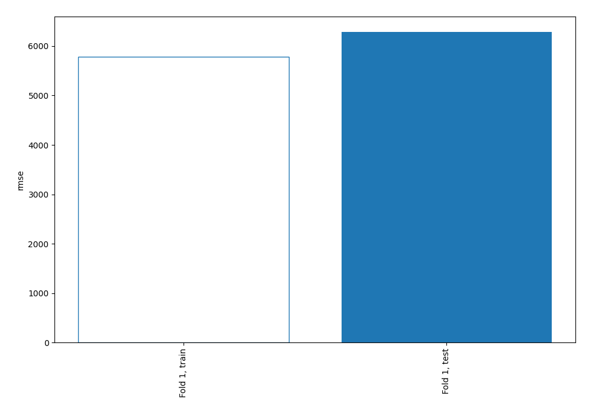
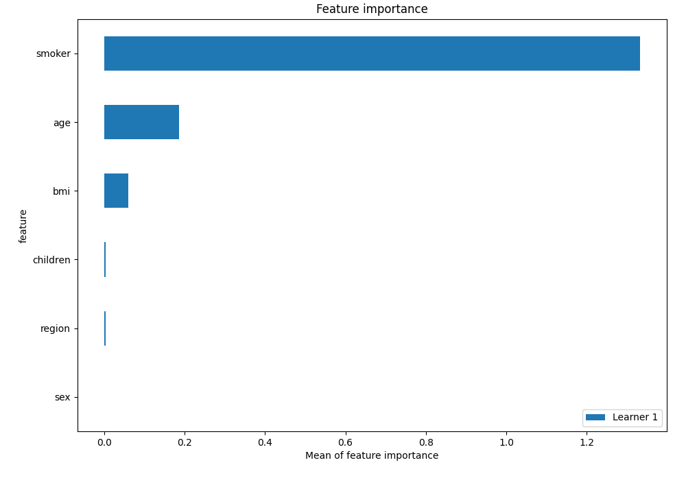
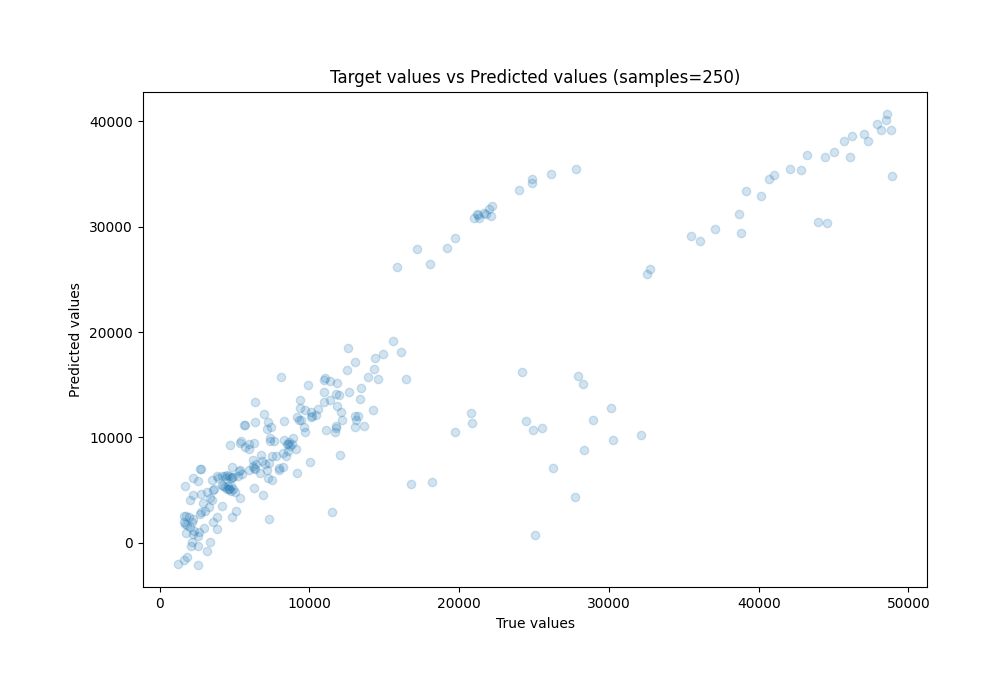
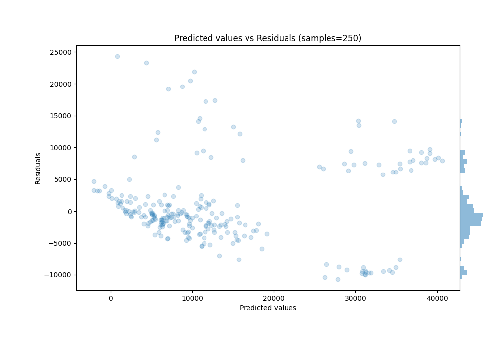
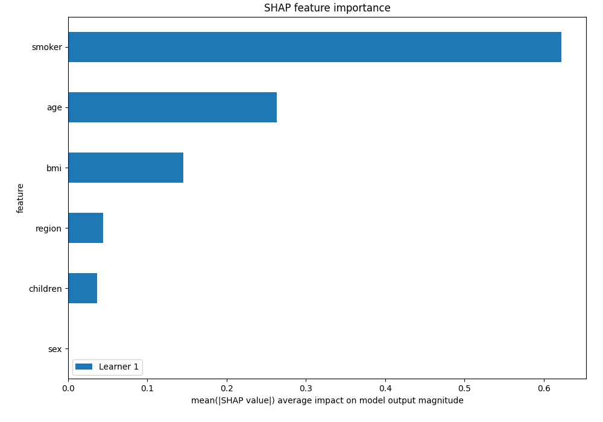
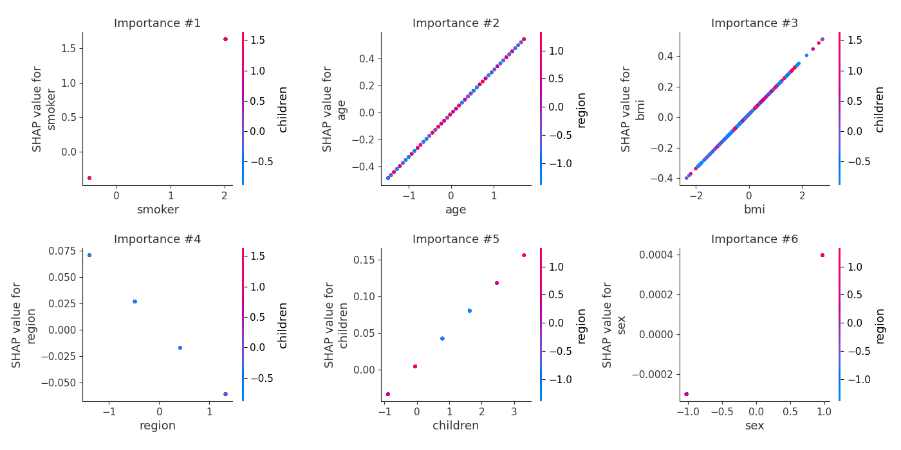
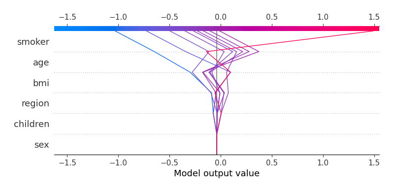
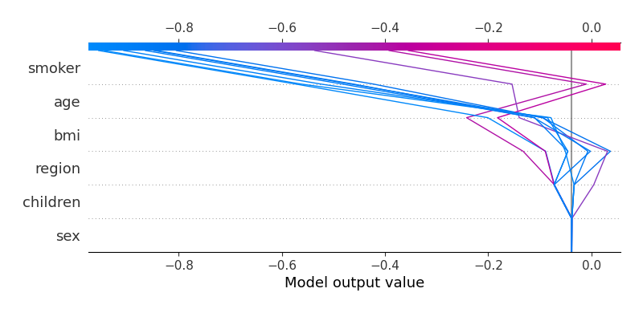

# Summary of 3_Linear

[<< Go back](../README.md)

## Linear Regression (Linear)
- **n_jobs**: -1
- **explain_level**: 2

## Validation
 - **validation_type**: split
 - **train_ratio**: 0.75
 - **shuffle**: True

## Optimized metric
rmse

## Training time

3.2 seconds

### Metric details:
| Metric   |          Score |
|:---------|---------------:|
| MAE      | 4298.61        |
| MSE      |    3.95162e+07 |
| RMSE     | 6286.19        |
| R2       |    0.755476    |
| MAPE     |    0.38894     |

## Learning curves

## Coefficients
| feature   |    Learner_1 |
|:----------|-------------:|
| smoker    |  0.801335    |
| age       |  0.319925    |
| bmi       |  0.177483    |
| children  |  0.0454285   |
| sex       |  0.000349028 |
| intercept |  8.81327e-17 |
| region    | -0.0483806   |

## Permutation-based Importance

## True vs Predicted

## Predicted vs Residuals

## SHAP Importance

## SHAP Dependence plots

### Dependence (Fold 1)

## SHAP Decision plots

### Top-10 Worst decisions (Fold 1)

### Top-10 Best decisions (Fold 1)

[<< Go back](../README.md)
