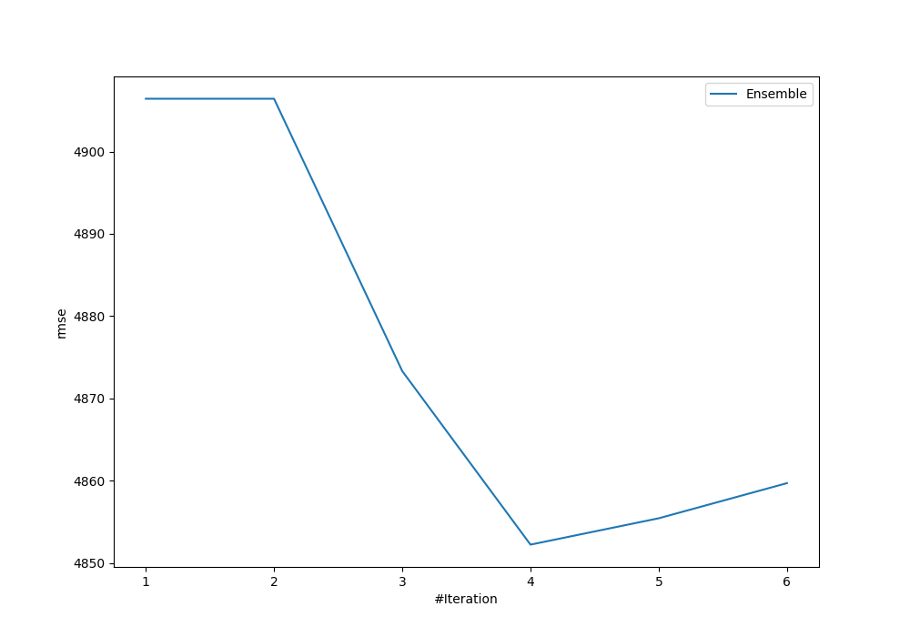
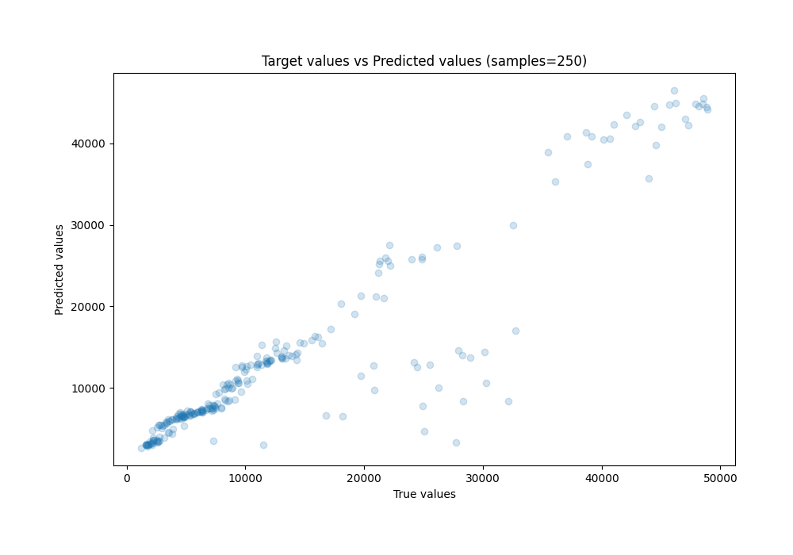
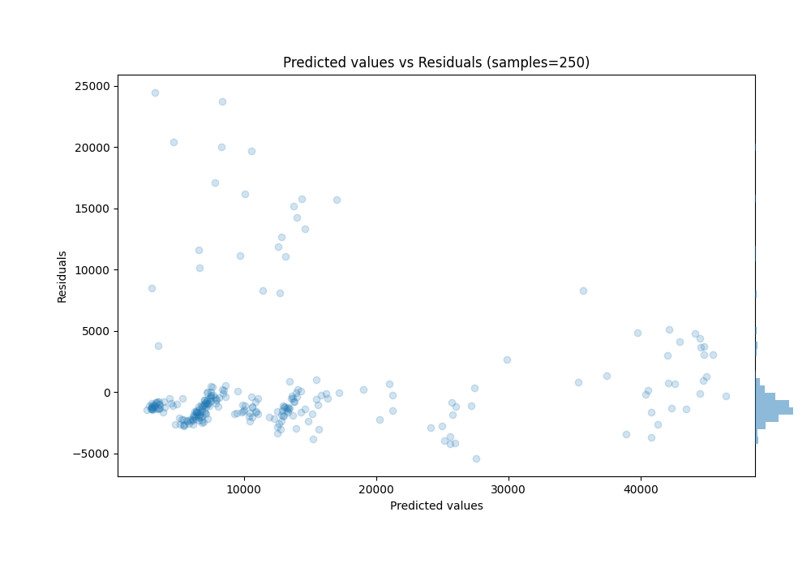

# Summary of Ensemble

[<< Go back](../README.md)

## Ensemble structure
| Model                   |   Weight |
|:------------------------|---------:|
| 2_DecisionTree          |        1 |
| 5_Default_NeuralNetwork |        1 |
| 6_Default_RandomForest  |        2 |

### Metric details:
| Metric   |          Score |
|:---------|---------------:|
| MAE      | 2686.22        |
| MSE      |    2.35441e+07 |
| RMSE     | 4852.22        |
| R2       |    0.854311    |
| MAPE     |    0.284661    |

## Learning curves

## True vs Predicted

## Predicted vs Residuals

[<< Go back](../README.md)
