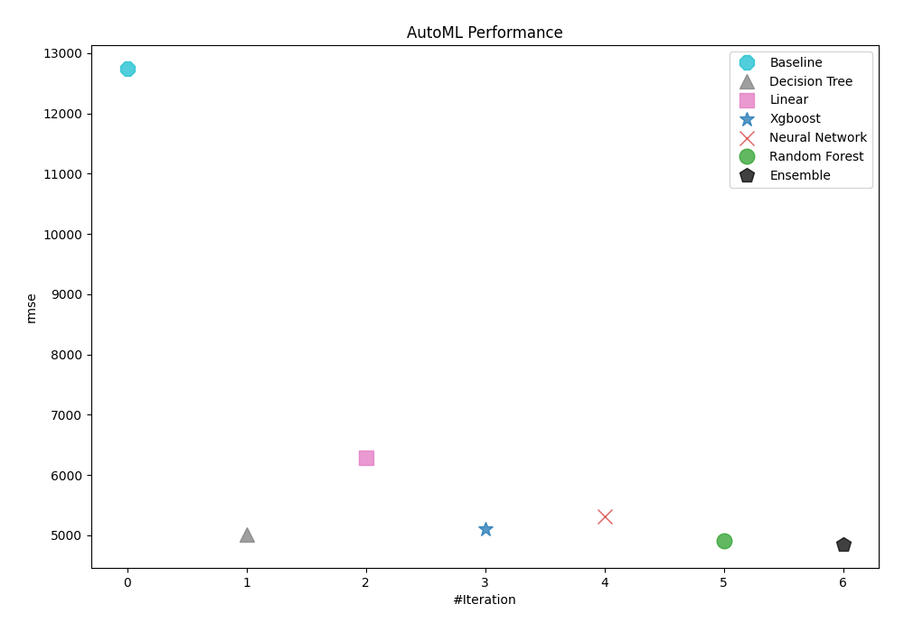
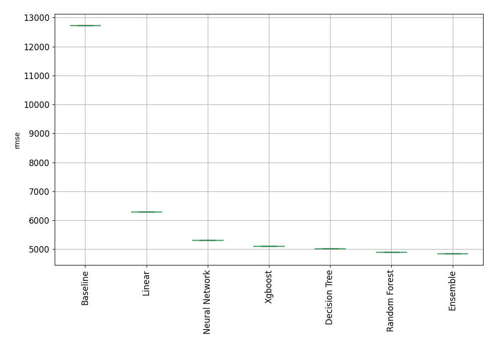
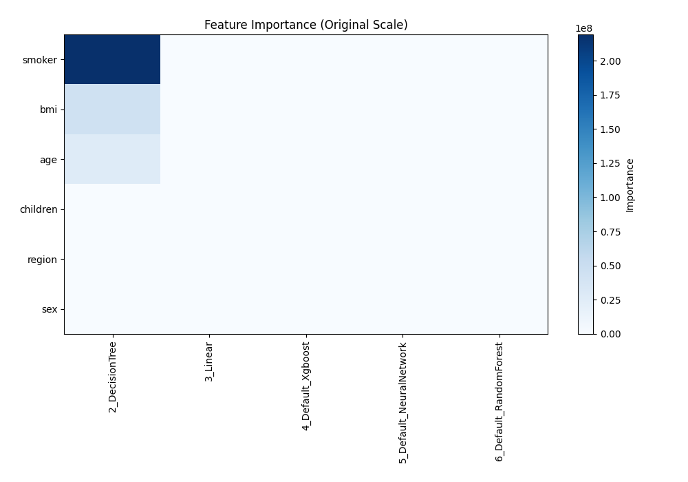
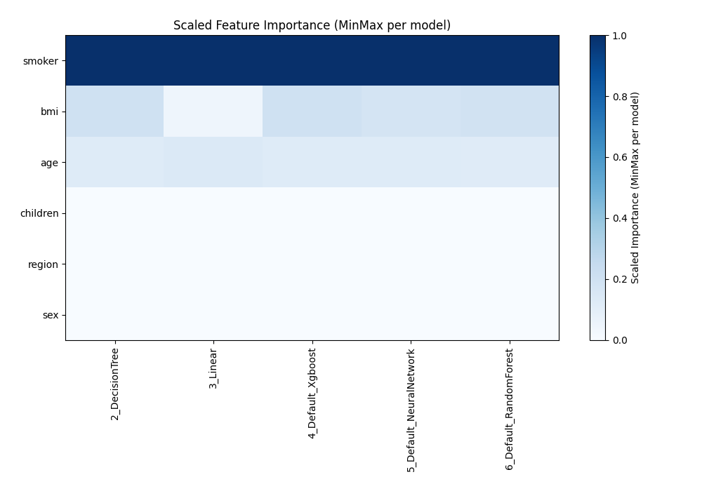
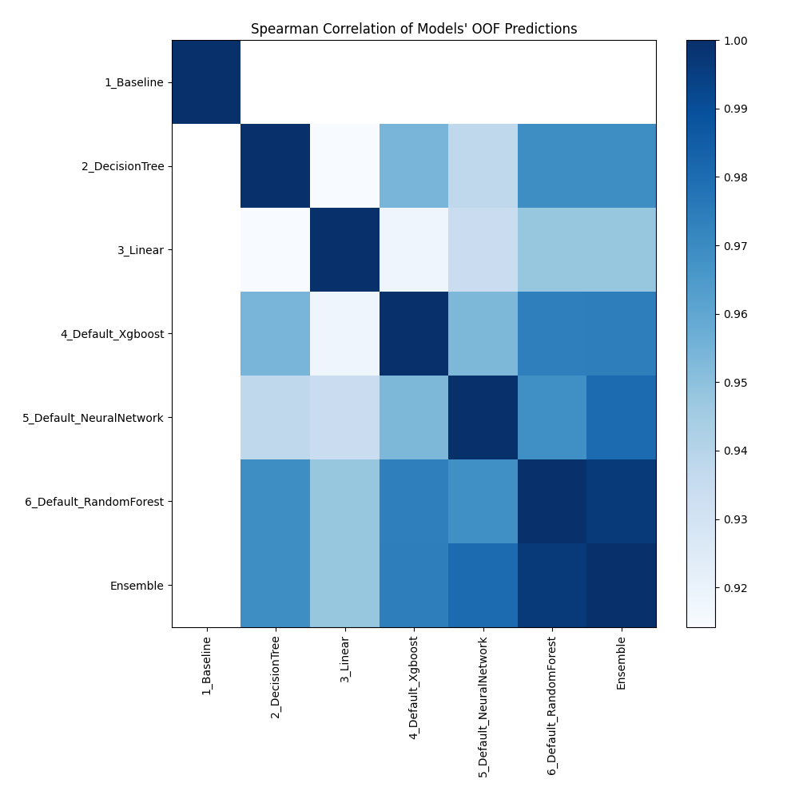

# AutoML Leaderboard

> Models in this report were generated and selected automatically by MLJAR AutoML. Review model behavior, data suitability, and decision impact before important use.

| Best model   | name                                                         | model_type     | metric_type   |   metric_value |   train_time |
|:-------------|:-------------------------------------------------------------|:---------------|:--------------|---------------:|-------------:|
|              | [1_Baseline](1_Baseline/README.md)                           | Baseline       | rmse          |       12736.3  |         1.06 |
|              | [2_DecisionTree](2_DecisionTree/README.md)                   | Decision Tree  | rmse          |        5017.67 |         5.07 |
|              | [3_Linear](3_Linear/README.md)                               | Linear         | rmse          |        6286.19 |         4.43 |
|              | [4_Default_Xgboost](4_Default_Xgboost/README.md)             | Xgboost        | rmse          |        5105.24 |        26.05 |
|              | [5_Default_NeuralNetwork](5_Default_NeuralNetwork/README.md) | Neural Network | rmse          |        5304.19 |         4.47 |
|              | [6_Default_RandomForest](6_Default_RandomForest/README.md)   | Random Forest  | rmse          |        4906.42 |         5.92 |
| **the best** | [Ensemble](Ensemble/README.md)                               | Ensemble       | rmse          |        4852.22 |         0.18 |

### AutoML Performance

### AutoML Performance Boxplot

### Features Importance (Original Scale)

### Scaled Features Importance (MinMax per Model)

### Spearman Correlation of Models

